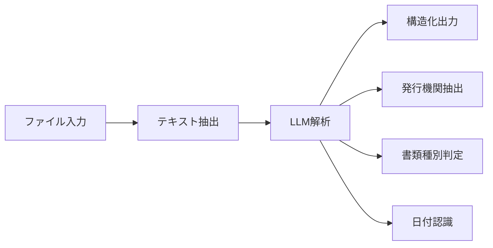

# PDF File Renamer

PDFファイルをAIで自動分析してリネームするWebアプリケーションです。Dify APIを使用して、医療関連書類の発行機関と書類種別を自動的に識別し、適切なファイル名に変更します。

## 🚀 機能

### 🤖 AI自動分析

- **Dify AI**: 発行機関と書類種別を自動識別
- **多言語対応**: 日本語の医療書類に最適化
- **高精度**: 医療関連書類の専門的な識別

### 📄 ファイル処理

- **対応形式**: PDF、JPEG、PNG（最大10MB）
- **一括処理**: 最大6ファイルまで同時処理
- **順次処理**: 安定性を重視した1ファイルずつの処理
- **リアルタイム進捗**: 処理状況をリアルタイム表示

### 📊 管理機能

- **統計表示**: 処理件数、成功率、処理時間の可視化
- **ファイル管理**: アップロード済みファイルの一覧・削除
- **ダウンロード**: 個別・一括ダウンロード対応
- **エラーハンドリング**: 詳細なエラー情報とリトライ機能

### 🔧 システム監視

- **ヘルスチェック**: システム全体の状態監視
- **Dify接続テスト**: AI APIの接続状況確認
- **デバッグモード**: 開発者向け詳細ログ表示

## 📋 対応書類

### 医療関連書類

- 診療報酬明細書（レセプト）
- 医療費通知
- 診断書・意見書
- 処方箋
- 検査結果報告書

### 保険関連書類

- 健康保険証
- 返戻内訳書
- 増減点連絡書
- 過誤・再審査結果通知書

### その他

- 医療機関発行の各種証明書
- 薬局発行の書類

## 🛠️ 技術スタック

### フロントエンド

- **HTML5/CSS3**: レスポンシブデザイン
- **JavaScript (ES6+)**: バニラJavaScript実装
- **CSS Grid/Flexbox**: モダンなレイアウト
- **Progressive Enhancement**: 段階的機能向上

### バックエンド

- **Node.js 18+**: サーバーレス関数
- **Vercel Functions**: スケーラブルなAPI実行環境
- **CommonJS/ES Modules**: 混在モジュール対応

### AI・API

- **Dify AI Platform**: 文書解析エンジン
- **Workflow API**: カスタムワークフロー実行
- **File Upload API**: 安全なファイルアップロード

### デプロイ・インフラ

- **Vercel**: サーバーレス自動デプロイ
- **GitHub**: ソースコード管理・CI/CD
- **Edge Functions**: グローバル分散実行

## 🔧 ローカル開発

### 1. 前提条件

```bash
node -v  # v18.0.0以上
npm -v   # v8.0.0以上
```

### 2. プロジェクトセットアップ

```bash
# リポジトリのクローン
git clone <repository-url>
cd pdf-file-renamer

# 依存関係のインストール
npm install

# Vercel CLIのインストール（グローバル）
npm install -g vercel
```

### 3. 環境変数の設定

```bash
# .env.localファイルを作成（ローカル開発用）
DIFY_API_KEY=your_dify_api_key_here
DIFY_BASE_URL=https://api.dify.ai/v1
```

### 4. ローカル実行

```bash
# 開発サーバー起動
vercel dev

# ブラウザでアクセス
open http://localhost:3000
```

### 5. 動作確認

- **API接続テスト**: 右上の状態インジケーターが緑色になることを確認
- **ファイルアップロード**: PDF/画像ファイルのドラッグ&ドロップ
- **処理機能**: ファイル分析とリネーム機能の動作確認

## 🌐 本番デプロイ

### Vercel での自動デプロイ

#### 1. GitHubリポジトリと連携

```bash
# 変更をコミット
git add .
git commit -m "feat: AI document analysis and renaming system"
git push origin main
```

#### 2. Vercel プロジェクト作成

1. [Vercel Dashboard](https://vercel.com/dashboard) にアクセス
1. 「New Project」をクリック
1. GitHubリポジトリを選択
1. プロジェクト設定を確認してデプロイ

#### 3. 環境変数の設定

Vercel Dashboard > Settings > Environment Variables で設定:

```env
DIFY_API_KEY=your_production_dify_api_key
DIFY_BASE_URL=https://api.dify.ai/v1
```

#### 4. カスタムドメイン設定（オプション）

- Vercel Dashboard > Settings > Domains
- カスタムドメインの追加・DNS設定

## 📁 プロジェクト構造

```
pdf-file-renamer/
├── 📄 index.html              # メインWebアプリケーション
├── 📁 api/                    # サーバーレス API エンドポイント
│   ├── health.js              # 統合ヘルスチェック・Dify接続テスト
│   └── process.js             # PDF分析・リネーム処理
├── 📦 package.json            # Node.js依存関係・スクリプト
├── ⚙️ vercel.json             # Vercel設定・ルーティング
├── 🚫 .gitignore             # Git除外ファイル設定
└── 📖 README.md              # プロジェクト説明（このファイル）
```

### API エンドポイント詳細

#### `GET /api/health`

**統合ヘルスチェック・システム監視**

- 基本システム状態確認
- Dify API接続テスト
- 環境変数設定状況
- パフォーマンス情報

**レスポンス例:**

```json
{
  "status": "healthy",
  "message": "All systems operational",
  "dify_connection": {
    "status": "connected",
    "response_time": 245
  },
  "configuration_summary": {
    "ready_for_processing": true
  }
}
```

#### `POST /api/process`

**ファイル分析・リネーム処理**

- PDF/画像ファイルの解析
- AI による書類識別
- 自動ファイル名生成
- Base64ファイルデータ返却

**リクエスト形式:**

- `Content-Type: application/json` (複数ファイル)
- `Content-Type: multipart/form-data` (単一ファイル)

**レスポンス例:**

```json
{
  "success": true,
  "results": [{
    "original_filename": "document.pdf",
    "new_filename": "2024-01-15_東京病院_診療報酬明細書.pdf",
    "status": "success",
    "analysis": {
      "document_type": "診療報酬明細書",
      "issuing_organization": "東京病院",
      "document_date": "2024-01-15"
    }
  }]
}
```

## 🔑 Dify 設定

### 1. Dify アカウント・ワークスペース作成

1. [Dify](https://dify.ai) でアカウント作成
1. 新しいワークスペースを作成
1. APIキーを取得

### 2. ワークフロー設計

#### 必要なノード構成:



#### 出力パラメータ設定:

- `document_type`: 書類の種別
- `issuing_organization`: 発行機関名
- `document_date`: 発行日または対象期間
- `document_name`: 生成されるファイル名のベース

### 3. プロンプト例

```
以下の医療関連書類を分析し、指定された形式で情報を抽出してください：

【抽出項目】
1. 書類種別: 診療報酬明細書、医療費通知、診断書等
2. 発行機関: 病院名、クリニック名、薬局名等
3. 発行日: YYYY-MM-DD形式
4. 書類名: {発行機関}_{書類種別}の形式

【出力形式】
JSON形式で正確に出力してください。
```

### 4. API設定

1. ワークフローを「公開」状態に変更
1. API URLとキーを取得
1. Vercel環境変数に設定

## 🛡️ セキュリティ・制限事項

### ファイル制限

- **ファイルサイズ**: 最大10MB/ファイル、合計30MB
- **ファイル数**: 最大6ファイル/バッチ
- **対応形式**: PDF, JPEG, PNG のみ
- **処理時間**: 最大60秒/バッチ

### セキュリティ対策

- **CORS設定**: オリジン制限
- **入力検証**: ファイル形式・サイズ検証
- **レート制限**: Vercel標準制限
- **環境変数**: 秘匿情報の安全な管理
- **エラーハンドリング**: 情報漏洩防止

### プライバシー保護

- **一時処理**: ファイルはメモリ上でのみ処理
- **永続化なし**: サーバー側にファイル保存なし
- **暗号化通信**: HTTPS通信の強制

## 🔍 トラブルシューティング

### よくある問題と解決策

#### 1. Dify API接続エラー

**症状**: 「Dify接続エラー」の表示
**解決手順**:

```bash
# 環境変数確認
vercel env ls

# 正しいAPIキーの設定
vercel env add DIFY_API_KEY
vercel env add DIFY_BASE_URL

# 再デプロイ
vercel --prod
```

#### 2. ファイル処理の失敗

**症状**: アップロードしたファイルの処理でエラー
**確認項目**:

- ファイルサイズ（10MB以下）
- ファイル形式（PDF/JPEG/PNG）
- ネットワーク接続状況
- Dify APIの応答状況

#### 3. パフォーマンスの問題

**症状**: 処理が遅い・タイムアウト
**最適化方法**:

- ファイルサイズの削減
- 1度に処理するファイル数の調整
- 画像ファイルの解像度調整

### デバッグ機能の活用

#### デバッグモードの有効化

1. 「デバッグ表示切替」ボタンをクリック
1. 詳細ログパネルが表示される
1. 処理状況をリアルタイム監視

#### ログの読み方

```
[DEBUG 14:30:15] ファイル追加処理開始 {"fileCount": 2}
[DEBUG 14:30:16] Processing file 1/2: document.pdf
[DEBUG 14:30:18] File document.pdf API Response: 200
[DEBUG 14:30:20] ✅ File 1 completed successfully
```

## 📚 APIリファレンス

### 統合ヘルスチェック API

```http
GET /api/health
Accept: application/json
```

**レスポンス構造:**

```typescript
interface HealthResponse {
  status: 'healthy' | 'warning' | 'degraded';
  message: string;
  timestamp: string;
  response_time: number;
  
  system: {
    status: 'operational';
    uptime: number;
    memory_usage: NodeJS.MemoryUsage;
    environment_vars: {
      DIFY_API_KEY: 'set' | 'missing';
      DIFY_BASE_URL: 'set' | 'missing';
    };
  };
  
  dify_connection: {
    status: 'connected' | 'failed' | 'not_configured' | 'error';
    message: string;
    response_time: number | null;
    error?: string;
  };
  
  configuration_summary: {
    dify_configured: boolean;
    api_functional: boolean;
    ready_for_processing: boolean;
  };
}
```

### ファイル処理 API

```http
POST /api/process
Content-Type: application/json
```

**リクエスト構造:**

```typescript
interface ProcessRequest {
  files: Array<{
    name: string;
    size: number;
    type: string;
    data: string; // Base64 encoded
  }>;
  timestamp: string;
}
```

**レスポンス構造:**

```typescript
interface ProcessResponse {
  success: boolean;
  message: string;
  timestamp: string;
  results: Array<{
    original_filename: string;
    new_filename: string;
    status: 'success' | 'error';
    analysis?: {
      document_type: string;
      issuing_organization: string;
      document_date: string;
      document_name: string;
    };
    fileData?: string; // Base64 encoded
    error?: string;
    processing_time: number;
  }>;
  summary: {
    total: number;
    successful: number;
    failed: number;
    success_rate: number;
    total_duration: number;
  };
}
```

## 📈 パフォーマンス最適化

### 推奨設定

- **ファイルサイズ**: 2MB以下を推奨
- **画像解像度**: 300DPI以下
- **バッチサイズ**: 3ファイル以下を推奨
- **ネットワーク**: 安定した接続環境

### 処理時間の目安

- **PDF (1MB)**: 10-15秒
- **JPEG (2MB)**: 8-12秒
- **PNG (3MB)**: 12-20秒

## 🤝 コントリビューション

### 開発への参加

1. リポジトリをフォーク
1. フィーチャーブランチを作成: `git checkout -b feature/amazing-feature`
1. 変更をコミット: `git commit -m 'feat: add amazing feature'`
1. ブランチにプッシュ: `git push origin feature/amazing-feature`
1. プルリクエストを作成

### コーディング規約

- **JavaScript**: ES6+ Modern Syntax
- **コミット**: Conventional Commits形式
- **命名**: キャメルケース（関数）、ケバブケース（CSS）
- **コメント**: 日本語での詳細説明

### 課題報告

GitHub Issuesを使用して以下の情報を含めて報告:

- 環境情報（OS、ブラウザ、Node.jsバージョン）
- 再現手順
- 期待される動作と実際の動作
- エラーメッセージ・ログ

## 📄 ライセンス

このプロジェクトは [MIT License](LICENSE) のもとで公開されています。

### 使用している主要ライブラリ

- **formidable** (^3.5.1) - ファイルアップロード処理
- **form-data** (^4.0.0) - マルチパートデータ処理
- **node-fetch** (^2.7.0) - HTTP API クライアント

## 📞 サポート・問い合わせ

### セルフヘルプ

1. **FAQ**: 上記トラブルシューティングを確認
1. **デバッグモード**: アプリ内デバッグ機能を活用
1. **ログ確認**: ブラウザ開発者ツール（F12）でエラー確認

### 技術サポート

- **GitHub Issues**: バグ報告・機能要望
- **Discussions**: 質問・使用方法の相談
- **Wiki**: 詳細なドキュメント・チュートリアル

### システム要件

- **ブラウザ**: Chrome 90+, Firefox 88+, Safari 14+, Edge 90+
- **JavaScript**: 有効化必須
- **ネットワーク**: HTTPS接続対応

-----

**PDF File Renamer** - AIによる医療書類の自動分析・リネームシステム  
開発: 2024年 | 最終更新: 2024年6月